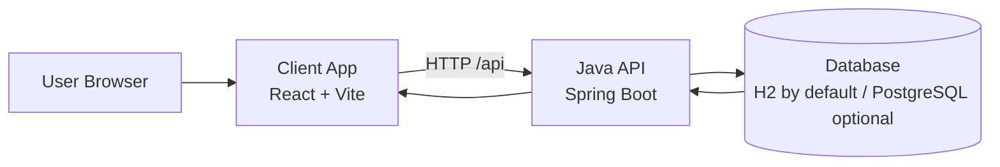

# Tessa Project (Client + Java Backend)

This repository contains a project management SaaS split into:
- `client`: the frontend web app
- `backend-java`: the Java Spring Boot API

Note: the Node backend is intentionally out of scope for this README.

## Project Definition

Tessa is a team project management platform where users can:
- authenticate
- create and manage workspaces
- manage members and roles
- create projects
- create and track tasks
- view workspace/project analytics

The frontend (React + Vite) communicates with the Java backend (Spring Boot), which handles business logic, security, and persistence.

## Architecture (Flow Diagram)



## Tech Stack and Main Dependencies

### Frontend (`client`)
- React `18.3.1`
- TypeScript `~5.6.2`
- Vite `^6.0.5`
- React Router DOM `^7.1.1`
- TanStack Query `^5.62.11`
- Tailwind CSS `^3.4.17`
- Radix UI components
- Axios `^1.7.9`
- Zod + React Hook Form

### Backend (`backend-java`)
- Java `17`
- Spring Boot `3.4.5`
- Spring Dependency Management `1.1.7`
- Gradle Wrapper `8.13`
- Spring starters:
  - Web
  - Data JPA
  - Security
  - Validation
  - OAuth2 Client
- Databases:
  - H2 (default runtime)
  - PostgreSQL (runtime option)

## Core Features

- Authentication and session handling
- Workspace management
- Member management and role-based permissions
- Project management
- Task management (status/priority/assignee/due date)
- Analytics endpoints for workspace/project tracking

## Run the Project Locally

### 1) Prerequisites

- Node.js 18+ and npm
- Java 17
- (Optional) PostgreSQL if you do not want to use default H2

### 2) Start Backend Java

From repository root:

```bash
cd backend-java
```

Windows:

```bash
gradlew.bat bootRun
```

macOS/Linux:

```bash
./gradlew bootRun
```

Default backend URL:
- `http://localhost:8000`
- API base path: `/api`

Default configuration (from `application.yml`):
- Port: `8000`
- DB: file-based H2 (`jdbc:h2:file:./data/tessa-db`)
- H2 console: `/h2-console`

### 3) Start Frontend Client

Open another terminal from repository root:

```bash
cd client
npm install
npm run dev
```

Frontend runs on:
- `http://localhost:5173` (Vite default)

Client environment (`client/.env`):

```env
VITE_API_BASE_URL="http://localhost:8000/api"
```

### 4) Build Commands

Frontend build:

```bash
cd client
npm run build
```

Backend tests:

```bash
cd backend-java
gradlew.bat test
```
